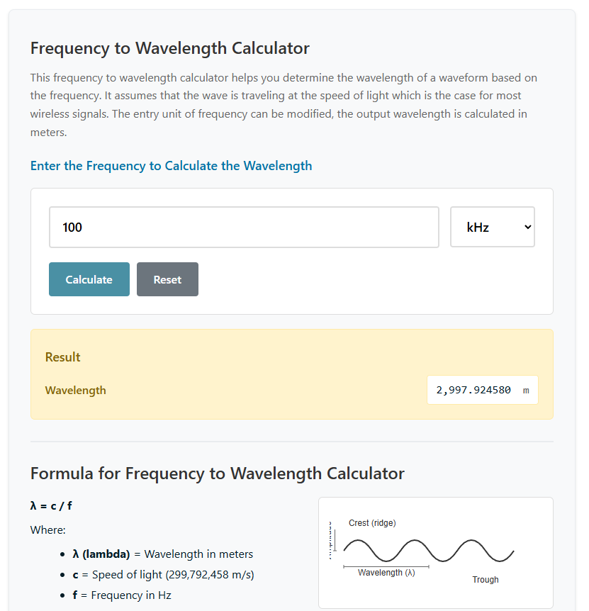

# 📡 RF Frequency to Wavelength Calculator

[](https://wordpress.org)
[](https://github.com/yourrepo/rf-calculator)
[](https://www.mozilla.org/en-US/MPL/2.0/)
[](https://php.net)

> A professional RF calculator that converts frequencies to wavelengths using the speed of light.

---

## 📋 Plugin Information

| **Field** | **Value** |
|-----------|-----------|
| **Contributors** | David McHale, John Shedd |
| **Tags** | rf, calculator, frequency, wavelength, radio |
| **Requires WordPress** | 5.0+ |
| **Tested up to** | 6.4 |
| **Requires PHP** | 7.4+ |
| **Stable tag** | 1.0.4 |
| **License** | [MPLv2 or later](https://www.mozilla.org/en-US/MPL/2.0/) |

---

## Description

The **RF Frequency to Wavelength Calculator** plugin provides a professional calculator tool that helps determine the wavelength of electromagnetic waves based on their frequency. This is essential for RF engineers, ham radio operators, and anyone working with wireless communications.

### Key Features

- 🔢 **Multi-Unit Support** - Convert frequencies in Hz, kHz, MHz, and GHz to wavelengths in meters
- ⚡ **Real-time Calculations** - AJAX-powered calculations for smooth user experience
- 📱 **Mobile Responsive** - Optimized design that works on all devices
- 📚 **Educational Content** - Includes wave diagram and formula explanation
- 🎨 **Professional Styling** - Modern design that matches contemporary web standards
- 🔗 **Easy Integration** - Simple shortcode support for embedding anywhere

### Quick Start

Simply add the shortcode to any post or page:

```shortcode
[rf_calculator]
```

**Custom Title Example:**
```shortcode
[rf_calculator title="Your Custom Title"]
```

### Technical Specifications

| **Specification** | **Details** |
|-------------------|-------------|
| **Speed of Light** | 299,792,458 m/s (exact value) |
| **Formula** | λ = c / f (wavelength = speed of light / frequency) |
| **Precision** | 6 decimal places |
| **Security** | Secure AJAX with nonce verification |
| **Performance** | Lightweight with minimal dependencies |

---

## 📦 Installation

### Method 1: WordPress Admin Dashboard
1. Navigate to **Plugins** → **Add New**
2. Click **Upload Plugin**
3. Choose the `rf-calculator-plugin.zip` file
4. Click **Install Now** and then **Activate**

### Method 2: Manual Installation
1. Upload plugin files to `/wp-content/plugins/rf-calculator-plugin/`
2. Activate the plugin through the **Plugins** screen in WordPress
3. Use the shortcode `[rf_calculator]` in your posts or pages

---

## ❓ Frequently Asked Questions

<details>
<summary><strong>How do I add the calculator to my page?</strong></summary>

Simply add the shortcode `[rf_calculator]` to any post or page where you want the calculator to appear.
</details>

<details>
<summary><strong>Can I customize the calculator title?</strong></summary>

Yes! Use `[rf_calculator title="Your Custom Title"]` to set a custom title.
</details>

<details>
<summary><strong>What frequency units are supported?</strong></summary>

The calculator supports Hz, kHz, MHz, and GHz input units.
</details>

<details>
<summary><strong>What is the output unit?</strong></summary>

Wavelength is always calculated and displayed in meters.
</details>

<details>
<summary><strong>Is the calculation accurate?</strong></summary>

Yes, the calculator uses the exact speed of light value (299,792,458 m/s) as defined by international standards.
</details>

---

## Screenshots



| Screenshot | Description |
|------------|-------------|
| **Interface (Top)** | RF calculator showing frequency input and unit selection |
| **Results (Middle)** | Results display with wavelength calculation |
| **Formula (Bottom)** | Formula explanation section with wave diagram |

---

## 📝 Changelog

### Version 1.0.4
- **CSS Update** - Improved styling to make unit selection better contained
- **Bug Fix** - Resolved dropdown overflow issues

### Version 1.0.3
- **Visibility** - Enhanced CSS styling to make inputs more visible
- **UX Improvement** - Better input field sizing and readability

### Version 1.0.2
- **Compatibility** - Updated to work with WordPress 6.7.2
- **Documentation** - Added additional license information
- **Maintenance** - Code optimization and cleanup

### Version 1.0.0
- **Initial Release**
- Frequency to wavelength conversion
- Support for Hz, kHz, MHz, GHz units
- AJAX-powered calculations
- Mobile responsive design
- Educational content and formula explanation

---

## ⚠️ Upgrade Notice

### Version 1.0.0
Initial release of the RF Frequency to Wavelength Calculator plugin.

---

## 🤝 Contributing

We welcome contributions! Please feel free to:

- 🐛 Report bugs
- 💡 Suggest features
- 🔧 Submit pull requests
- 📖 Improve documentation

---

## 📞 Support

Need help? Here are your options:

- 📧 **Email Support** - Contact the plugin authors
- 📚 **Documentation** - Check the FAQ section above
- 🐛 **Bug Reports** - Use the WordPress plugin support forum

---

## 📜 License

This plugin is licensed under the **Mozilla Public License v2.0 (MPLv2)**

[](https://www.mozilla.org/en-US/MPL/2.0/)

---

*Made with ❤️ by David McHale and John Shedd*